# Fluxo do app MyRobots — revisão de usabilidade

Versão de 06/10/2026 (branch `melhorias/v1.2`, commit `b5dc6d9`).

Este arquivo mostra **cada tela, cada função e todas as alternativas** do app, para a revisão
geral de usabilidade e da organização das funções.

## Como usar este arquivo

1. Cada tela tem um código (**T1**, **T2**…) e cada função dentro dela também (**T2.3**…).
   Use os códigos para dizer onde está a correção.
2. Embaixo de cada tela há um campo **✏️ Revisão**. Escreva ali o que deve mudar: o que tirar,
   juntar, mudar de lugar, renomear ou o que falta. Pode escrever direto no arquivo.
3. Os fluxos estão em diagramas (Mermaid): o GitHub e o Claude os desenham. Losango = escolha
   ou condição; retângulo = tela ou passo; caixa arredondada = resultado.
4. As fotos (celular, 06/10/2026) estão em `docs/telas/`, com o nome do código da tela
   (ex.: `t06_5_variaveis_sem_uso.jpg`). Para analisar no Claude, suba o `.md` e as fotos
   da parte que quiser comentar. Sem foto: G1 e G3 (só aparecem numa situação real de série
   trocada ou de erro no meio do LOAD) e T12 (é o mesmo editor da T8).
5. No fim há as **observações de usabilidade** que eu já notei (seção O) e um **rascunho de
   nova organização** (seção N), só para começar a conversa.
6. Mande o arquivo de volta com as revisões preenchidas; eu leio tela por tela e faço as
   mudanças.

---

## 0. Mapa geral das telas

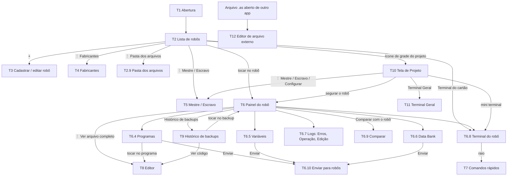
```mermaid
flowchart TD
    T1["T1 Abertura"] --> T2["T2 Lista de robôs"]
    T2 -->|"+"| T3["T3 Cadastrar / editar robô"]
    T2 -->|"⋮ Fabricantes"| T4["T4 Fabricantes"]
    T2 -->|"⋮ Mestre / Escravo"| T5["T5 Mestre / Escravo"]
    T2 -->|"⋮ Pasta dos arquivos"| T2P["T2.9 Pasta dos arquivos"]
    T2 -->|"tocar no robô"| T6["T6 Painel do robô"]
    T2 -->|"Terminal do cartão"| T6T["T6.8 Terminal do robô"]
    T2 -->|"ícone de grade do projeto"| T10["T10 Tela de Projeto"]

    T6 --> T6P["T6.4 Programas"]
    T6 --> T6V["T6.5 Variáveis"]
    T6 --> T6D["T6.6 Data Bank"]
    T6 --> T6L["T6.7 Logs: Erros, Operação, Edição"]
    T6 --> T6T
    T6 -->|"Comparar com o robô"| T6C["T6.9 Comparar"]
    T6 -->|"Histórico de backups"| T9["T9 Histórico de backups"]
    T6 -->|"⋮ Ver arquivo completo"| T8["T8 Editor"]
    T6P -->|"tocar no programa"| T8
    T6P & T6V & T6D -->|"Enviar"| T6E["T6.10 Enviar para robôs"]
    T6T -->|"raio"| T7["T7 Comandos rápidos"]
    T9 -->|"Ver código"| T8
    T9 -->|"tocar no backup"| T6

    T10 -->|"segurar o robô"| T6
    T10 -->|"Terminal Geral"| T11["T11 Terminal Geral"]
    T10 -->|"⋮ Mestre / Escravo / Configurar"| T5
    T10 -->|"mini terminal"| T6T

    EXT["Arquivo .as aberto de outro app"] --> T12["T12 Editor de arquivo externo"]
```

**Janelas que aparecem por cima de qualquer tela** (seção G): série diferente, relógio
errado e pergunta do controlador no meio de uma transferência.

---

## G. Janelas globais

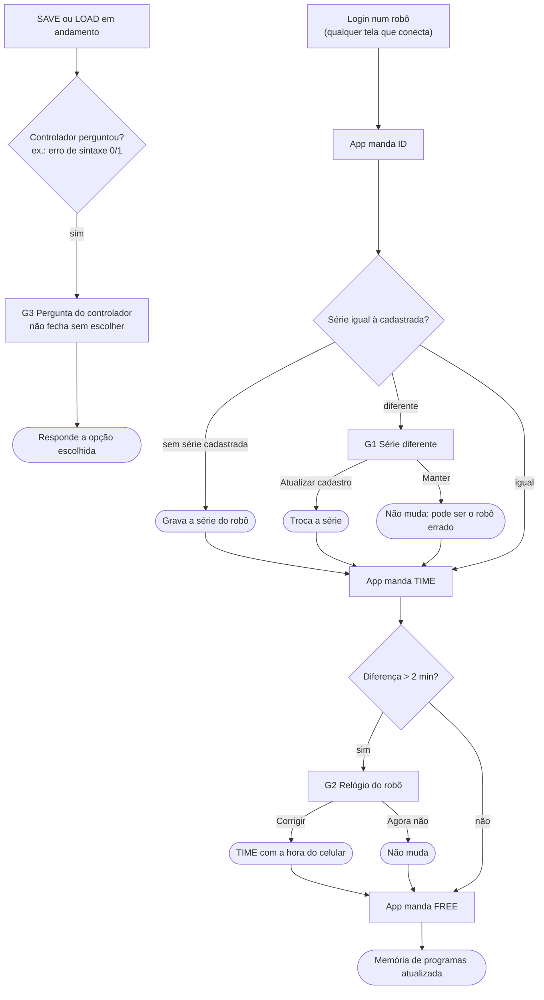
```mermaid
flowchart TD
    L["Login num robô<br/>(qualquer tela que conecta)"] --> ID["App manda ID"]
    ID --> S{"Série igual à cadastrada?"}
    S -->|"sem série cadastrada"| S1(["Grava a série do robô"])
    S -->|"diferente"| G1["G1 Série diferente"]
    G1 -->|"Atualizar cadastro"| S2(["Troca a série"])
    G1 -->|"Manter"| S3(["Não muda: pode ser o robô errado"])
    S -->|"igual"| TM["App manda TIME"]
    S1 --> TM
    S2 --> TM
    S3 --> TM
    TM --> C{"Diferença > 2 min?"}
    C -->|"sim"| G2["G2 Relógio do robô"]
    G2 -->|"Corrigir"| C1(["TIME com a hora do celular"])
    G2 -->|"Agora não"| C2(["Não muda"])
    C -->|"não"| FR["App manda FREE"]
    C1 --> FR
    C2 --> FR
    FR --> FM(["Memória de programas atualizada"])

    TR["SAVE ou LOAD em andamento"] --> Q{"Controlador perguntou?<br/>ex.: erro de sintaxe 0/1"}
    Q -->|"sim"| G3["G3 Pergunta do controlador<br/>não fecha sem escolher"]
    G3 --> Q1(["Responde a opção escolhida"])
```

- **G1 Série diferente** — sem foto (precisa de um robô com a série trocada)
- **G2 Relógio do robô** — no K-ROSET aparece sempre, com 12 h a mais:
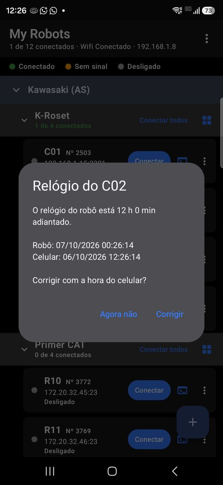
- **G3 Pergunta do controlador** — sem foto (precisa de um erro de sintaxe no meio de um LOAD)

✏️ **Revisão G:**

---

## T1. Abertura

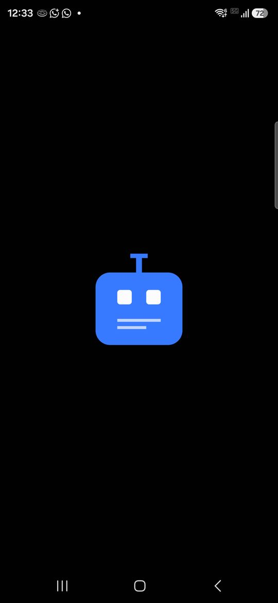

Desenho do robô por ~2,5 s e vai para a lista. Não tem ação.

✏️ **Revisão T1:**

---

## T2. Lista de robôs (tela inicial)

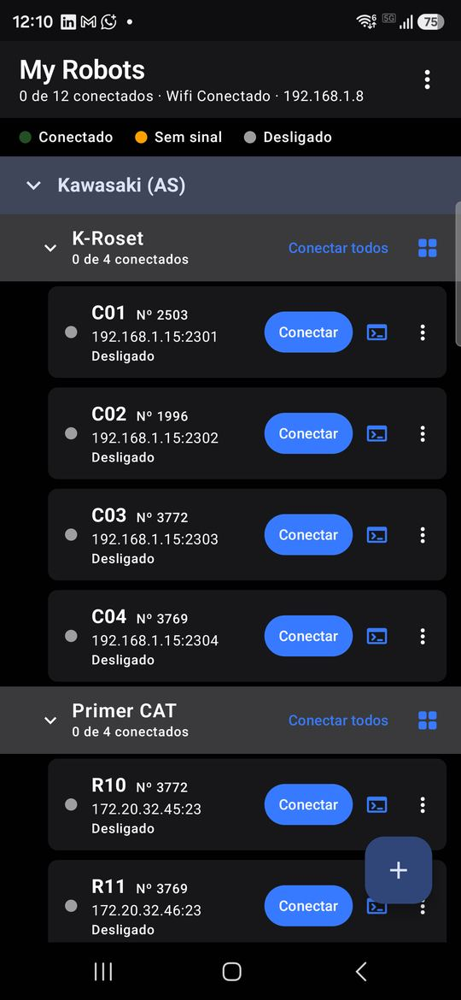 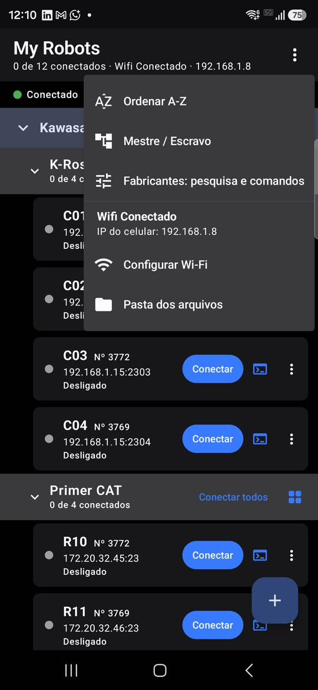 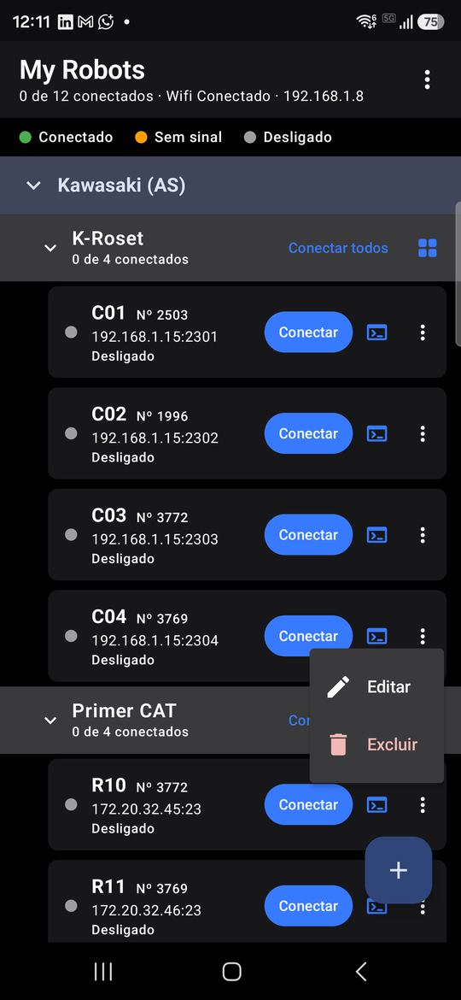 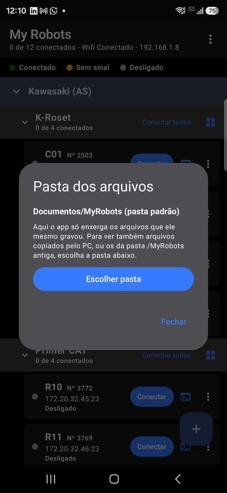

 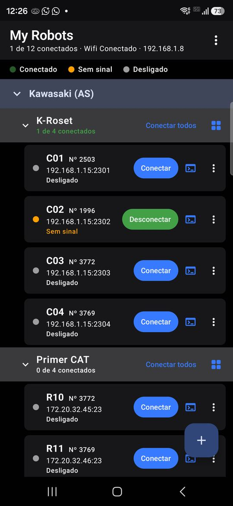

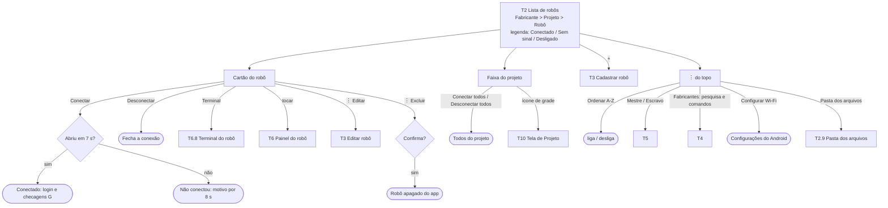
```mermaid
flowchart TD
    T2["T2 Lista de robôs<br/>Fabricante > Projeto > Robô<br/>legenda: Conectado / Sem sinal / Desligado"]
    T2 --> R["Cartão do robô"]
    R -->|"Conectar"| R1{"Abriu em 7 s?"}
    R1 -->|"sim"| R2(["Conectado: login e checagens G"])
    R1 -->|"não"| R3(["Não conectou: motivo por 8 s"])
    R -->|"Desconectar"| R4(["Fecha a conexão"])
    R -->|"Terminal"| T6T["T6.8 Terminal do robô"]
    R -->|"tocar"| T6["T6 Painel do robô"]
    R -->|"⋮ Editar"| T3["T3 Editar robô"]
    R -->|"⋮ Excluir"| R5{"Confirma?"}
    R5 -->|"sim"| R6(["Robô apagado do app"])

    T2 --> P["Faixa do projeto"]
    P -->|"Conectar todos / Desconectar todos"| P1(["Todos do projeto"])
    P -->|"ícone de grade"| T10["T10 Tela de Projeto"]

    T2 -->|"+"| T3N["T3 Cadastrar robô"]
    T2 --> M["⋮ do topo"]
    M -->|"Ordenar A-Z"| M1(["liga / desliga"])
    M -->|"Mestre / Escravo"| T5["T5"]
    M -->|"Fabricantes: pesquisa e comandos"| T4["T4"]
    M -->|"Configurar Wi-Fi"| M2(["Configurações do Android"])
    M -->|"Pasta dos arquivos"| T29["T2.9 Pasta dos arquivos"]
```

| Código | Função | Alternativas / detalhes |
|---|---|---|
| T2.1 | Ver os robôs | agrupados por fabricante → projeto; grupos abrem e fecham; subtítulo com conectados e Wi-Fi (nome e IP) |
| T2.2 | Conectar / Desconectar um robô | vários ao mesmo tempo; falha mostra o motivo |
| T2.3 | Terminal do robô | abre o painel direto no terminal |
| T2.4 | Abrir o painel | tocar no cartão; abre o backup mais recente |
| T2.5 | Editar / Excluir robô | ⋮ do cartão; excluir pede confirmação |
| T2.6 | Conectar / Desconectar todos | por projeto |
| T2.7 | Abrir a Tela de Projeto | ícone de grade na faixa do projeto |
| T2.8 | Cadastrar robô | botão "+" (T3) |
| T2.9 | Pasta dos arquivos | Documentos/MyRobots ou pasta escolhida; escolher importa os `.as` de lá; "Usar a pasta padrão" |
| T2.10 | Ordenar A-Z, Wi-Fi, Fabricantes, Mestre / Escravo | ⋮ do topo |
| — | Sozinho, ao abrir | importa os `.as` novos das pastas dos robôs (nunca apaga backup) |

✏️ **Revisão T2:**

---

## T3. Cadastrar / editar robô

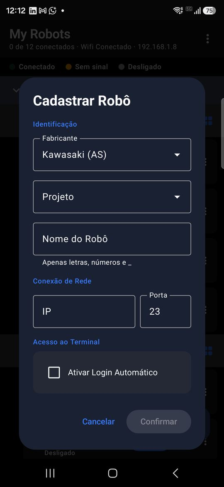 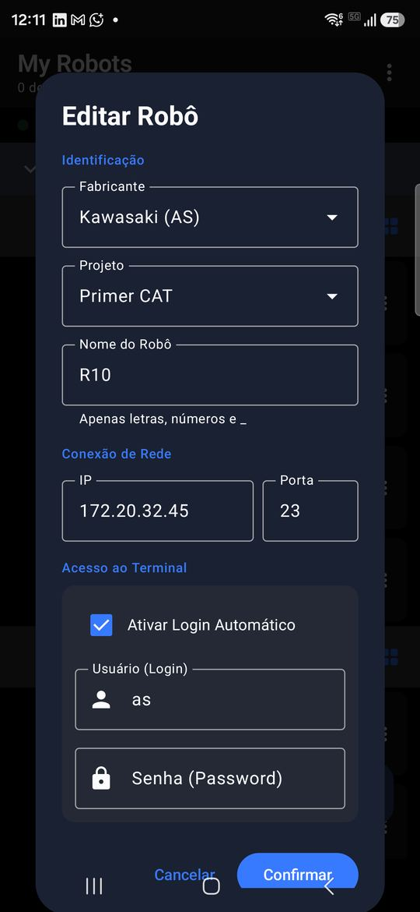

Campos: fabricante, projeto (com sugestões), nome (letras, números e `_`), IP, porta
(padrão 23), login automático (usuário e senha, opcional). **Confirmar** só com nome e IP.

✏️ **Revisão T3:**

---

## T4. Fabricantes

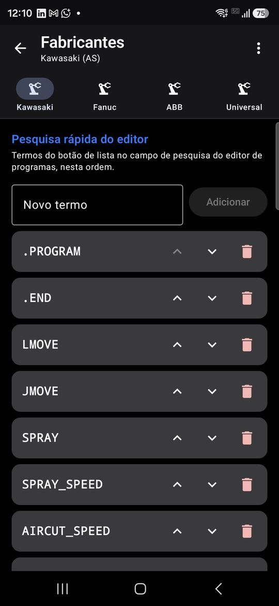 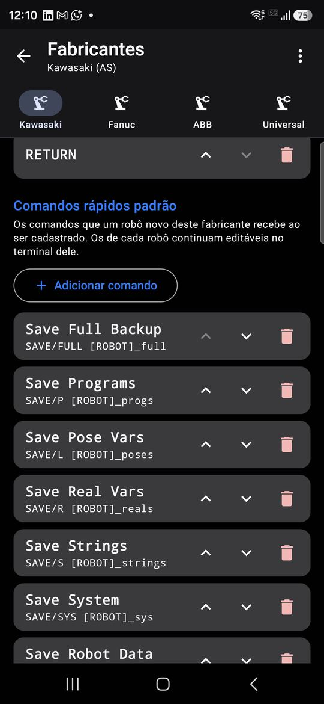 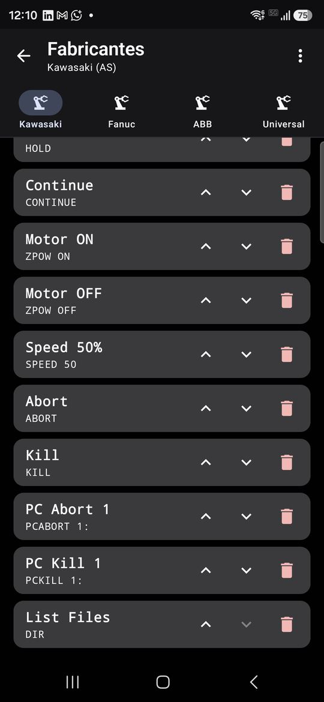 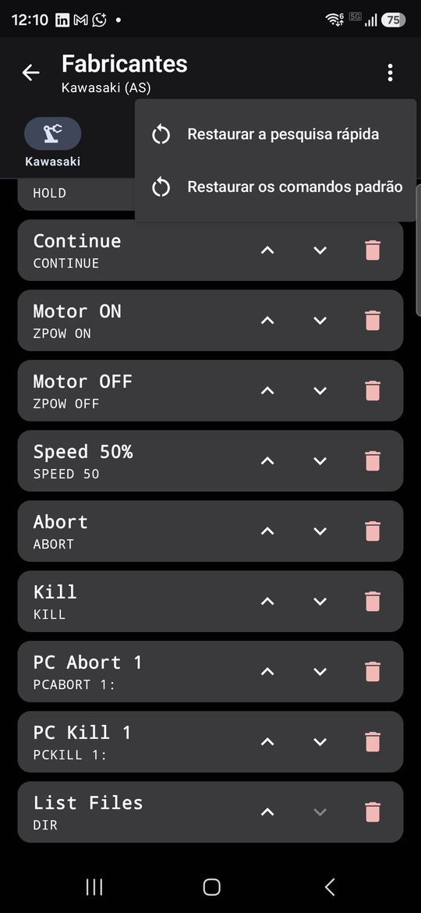

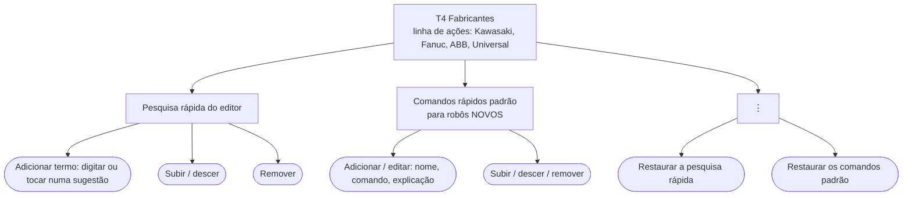
```mermaid
flowchart TD
    T4["T4 Fabricantes<br/>linha de ações: Kawasaki, Fanuc, ABB, Universal"]
    T4 --> A["Pesquisa rápida do editor"]
    A --> A1(["Adicionar termo: digitar ou tocar numa sugestão"])
    A --> A2(["Subir / descer"])
    A --> A3(["Remover"])
    T4 --> B["Comandos rápidos padrão<br/>para robôs NOVOS"]
    B --> B1(["Adicionar / editar: nome, comando, explicação"])
    B --> B2(["Subir / descer / remover"])
    T4 --> M["⋮"]
    M --> M1(["Restaurar a pesquisa rápida"])
    M --> M2(["Restaurar os comandos padrão"])
```

✏️ **Revisão T4:**

---

## T5. Mestre / Escravo (configuração)

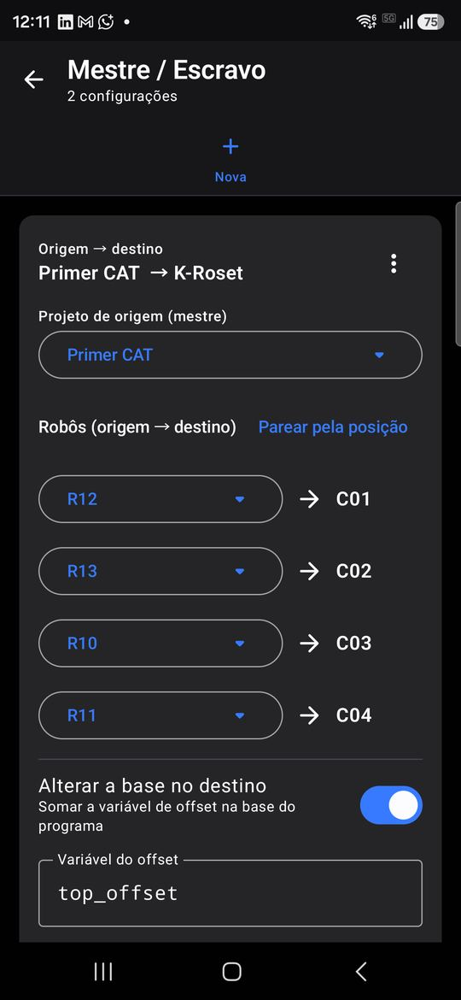  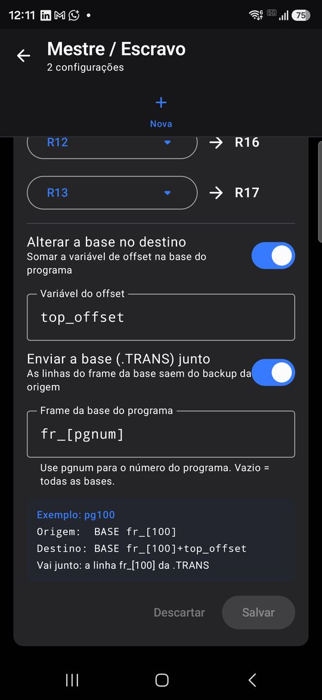

Aberta pelo ⋮ da lista, pelo ⋮ do projeto e pelo "Configurar" do desenho do projeto.

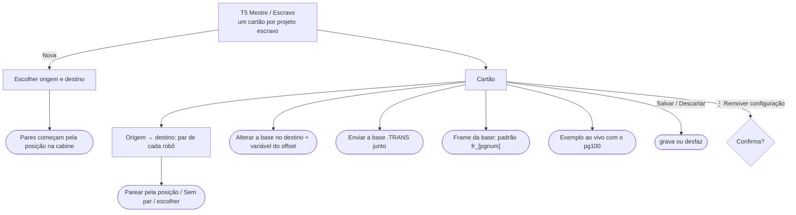
```mermaid
flowchart TD
    T5["T5 Mestre / Escravo<br/>um cartão por projeto escravo"]
    T5 -->|"Nova"| N1["Escolher origem e destino"]
    N1 --> N2(["Pares começam pela posição na cabine"])
    T5 --> C["Cartão"]
    C --> C1["Origem → destino: par de cada robô"]
    C1 --> C2(["Parear pela posição / Sem par / escolher"])
    C --> C3(["Alterar a base no destino + variável do offset"])
    C --> C4(["Enviar a base .TRANS junto"])
    C --> C5(["Frame da base: padrão fr_[pgnum]"])
    C --> C6(["Exemplo ao vivo com o pg100"])
    C -->|"Salvar / Descartar"| C7(["grava ou desfaz"])
    C -->|"⋮ Remover configuração"| C8{"Confirma?"}
```

✏️ **Revisão T5:**

---

## T6. Painel do robô

### T6.1 Home

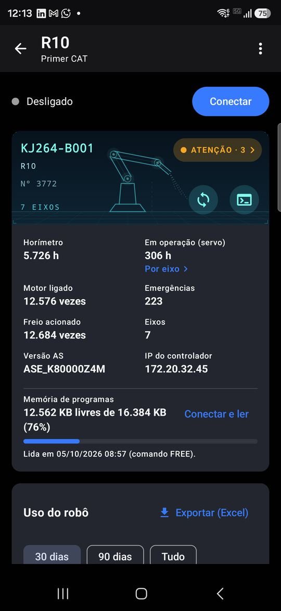 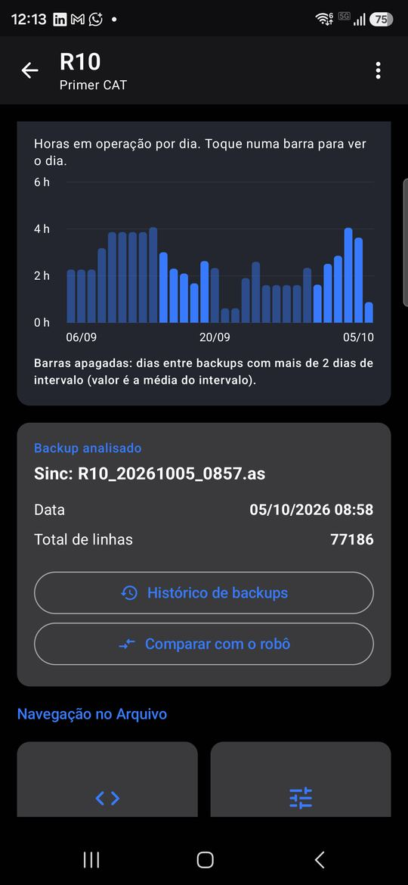 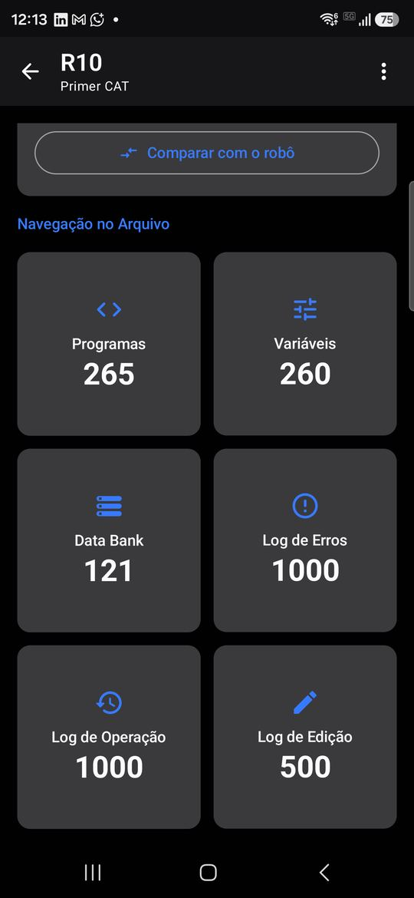 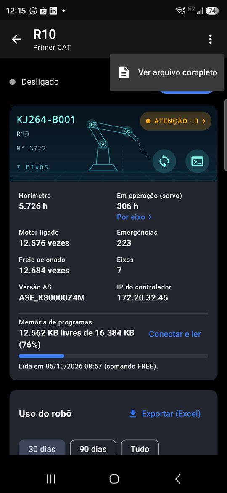

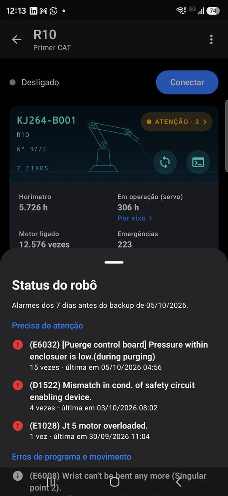 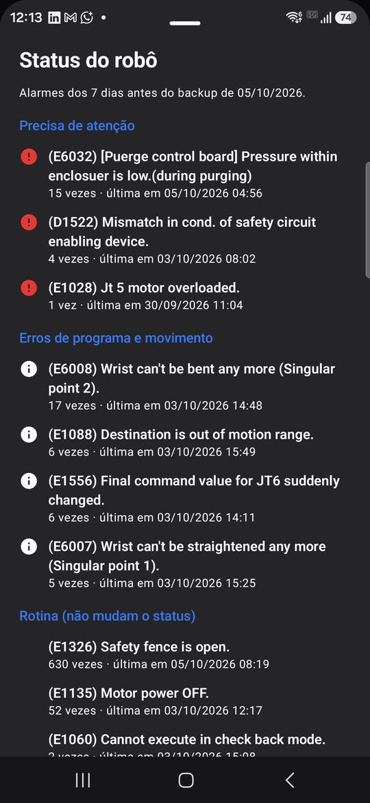 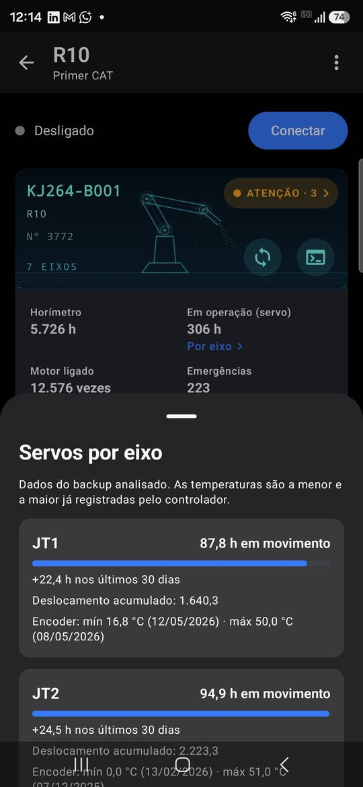 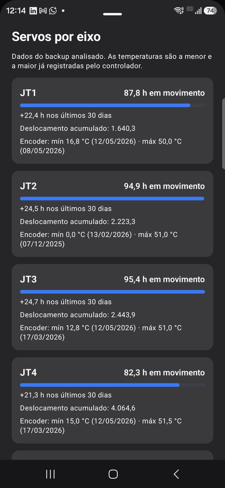

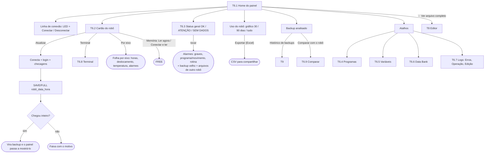
```mermaid
flowchart TD
    H["T6.1 Home do painel"]
    H --> C["Linha de conexão: LED + Conectar / Desconectar"]
    H --> R["T6.2 Cartão do robô"]
    R -->|"Atualizar"| U1["Conecta + login + checagens"]
    U1 --> U2["SAVE/FULL robô_data_hora"]
    U2 --> U3{"Chegou inteiro?"}
    U3 -->|"sim"| U4(["Vira backup e o painel passa a mostrá-lo"])
    U3 -->|"não"| U5(["Faixa com o motivo"])
    R -->|"Terminal"| T68["T6.8 Terminal"]
    R -->|"Por eixo"| PE(["Folha por eixo: horas, deslocamento, temperatura, alarmes"])
    R -->|"Memória: Ler agora / Conectar e ler"| ME(["FREE"])
    H --> S["T6.3 Status geral OK / ATENÇÃO / SEM DADOS"]
    S -->|"tocar"| S1(["Alarmes: graves, programa/movimento, rotina<br/>+ backup velho + arquivos de outro robô"])
    H --> UR["Uso do robô: gráfico 30 / 90 dias / tudo"]
    UR -->|"Exportar (Excel)"| UR1(["CSV para compartilhar"])
    H --> BA["Backup analisado"]
    BA -->|"Histórico de backups"| T9["T9"]
    BA -->|"Comparar com o robô"| T69["T6.9 Comparar"]
    H --> AT["Atalhos"]
    AT --> P["T6.4 Programas"]
    AT --> V["T6.5 Variáveis"]
    AT --> D["T6.6 Data Bank"]
    AT --> L["T6.7 Logs: Erros, Operação, Edição"]
    H -->|"⋮ Ver arquivo completo"| T8["T8 Editor"]
```

| Código | Função | Alternativas / detalhes |
|---|---|---|
| T6.1 | Conectar / Desconectar | linha no alto da home |
| T6.2 | Atualizar (backup completo agora) | conecta se preciso; SAVE/FULL conferido; nome com `_2` se repetir no minuto |
| T6.2 | Dados do controlador | horímetro, servo, motor ligou, emergências, freio, eixos, versão AS, IP; só com SAVE/FULL |
| T6.2 | Por eixo | horas em movimento, últimos 30 dias, deslocamento, temperatura do encoder, alarmes do eixo |
| T6.2 | Memória de programas | Ler agora / Conectar e ler; amarelo abaixo de 10% |
| T6.3 | Status geral | toque abre a lista de alarmes por gravidade |
| T6.1 | Uso do robô | gráfico por dia, médias, Exportar (Excel); precisa de 2 backups SAVE/FULL |
| T6.1 | Backup analisado | nome, data, linhas, aviso se não é o mais novo, Histórico, Comparar |
| T6.1 | ⋮ Ver arquivo completo | backup inteiro no editor |

✏️ **Revisão T6.1 a T6.3:**

### T6.4 Programas

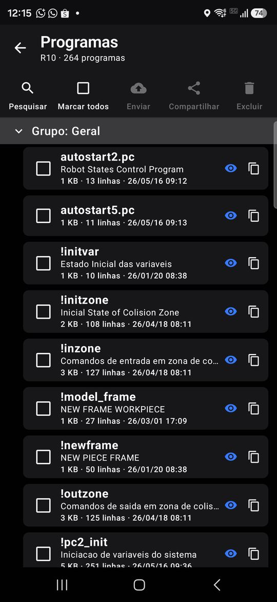 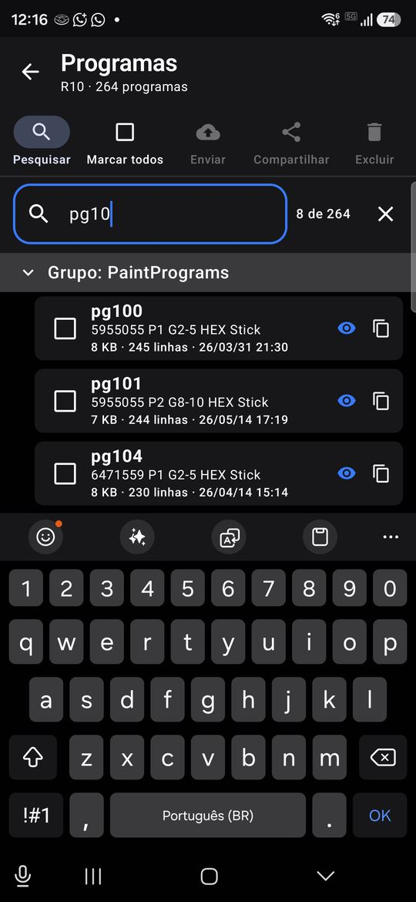 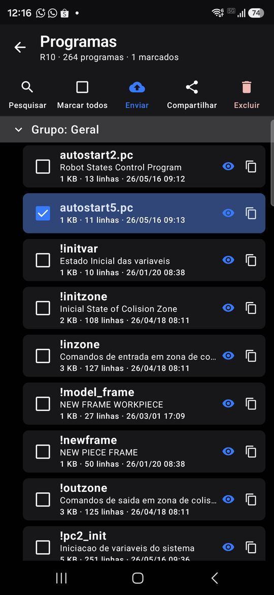 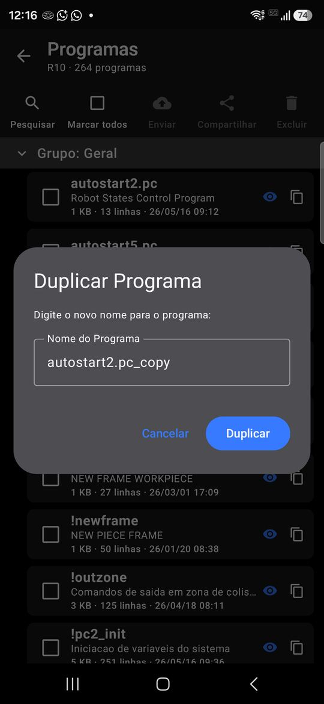

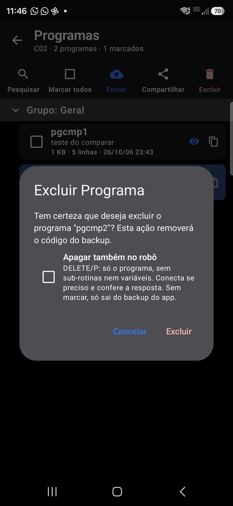

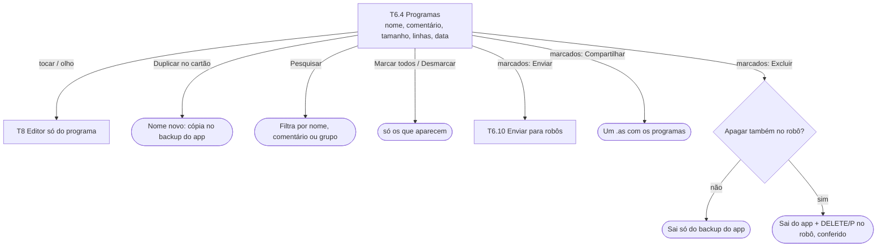
```mermaid
flowchart TD
    P["T6.4 Programas<br/>nome, comentário, tamanho, linhas, data"]
    P -->|"tocar / olho"| T8["T8 Editor só do programa"]
    P -->|"Duplicar no cartão"| D1(["Nome novo: cópia no backup do app"])
    P -->|"Pesquisar"| S1(["Filtra por nome, comentário ou grupo"])
    P -->|"Marcar todos / Desmarcar"| M1(["só os que aparecem"])
    P -->|"marcados: Enviar"| E["T6.10 Enviar para robôs"]
    P -->|"marcados: Compartilhar"| C1(["Um .as com os programas"])
    P -->|"marcados: Excluir"| X{"Apagar também no robô?"}
    X -->|"não"| X1(["Sai só do backup do app"])
    X -->|"sim"| X2(["Sai do app + DELETE/P no robô, conferido"])
```

✏️ **Revisão T6.4:**

### T6.5 Variáveis

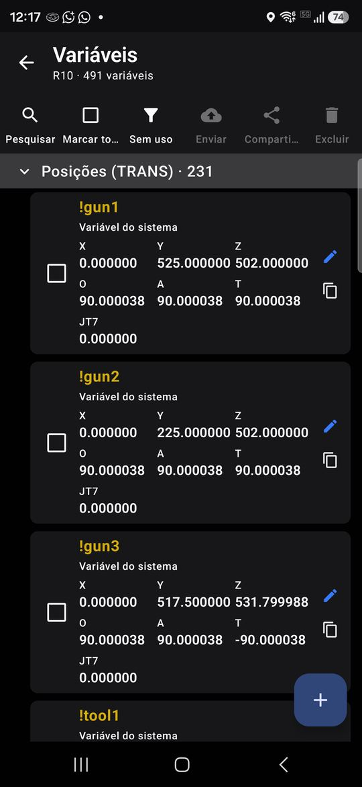 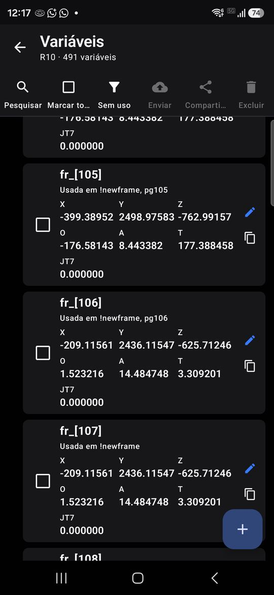 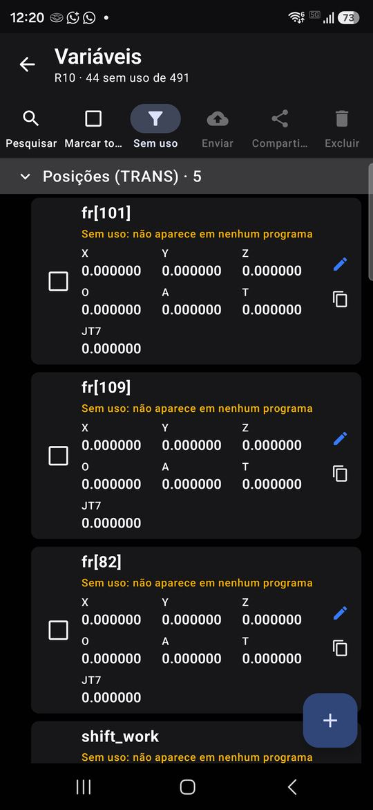 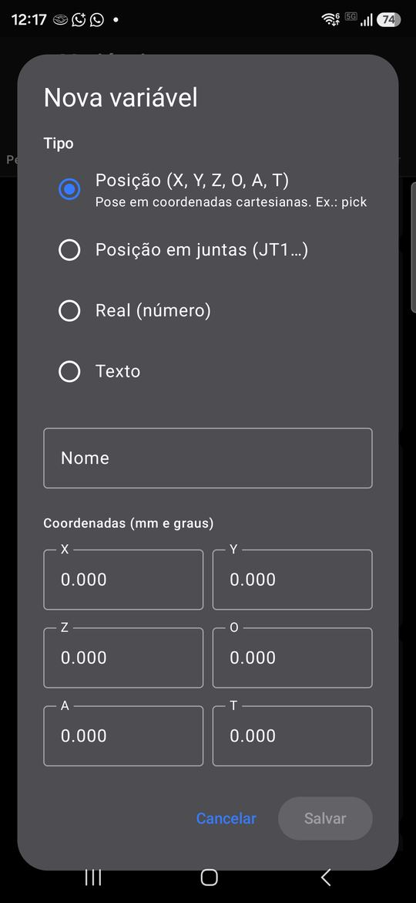

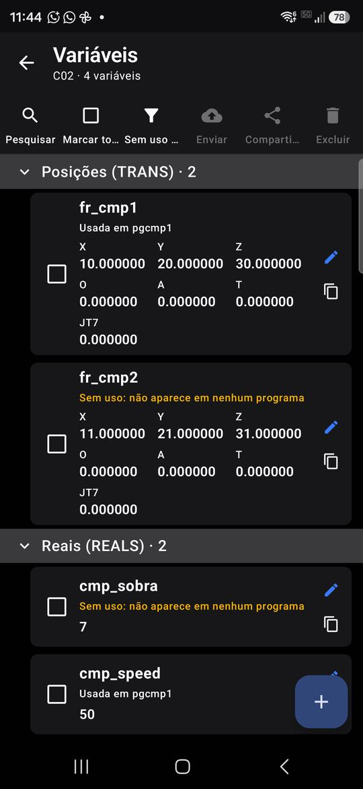 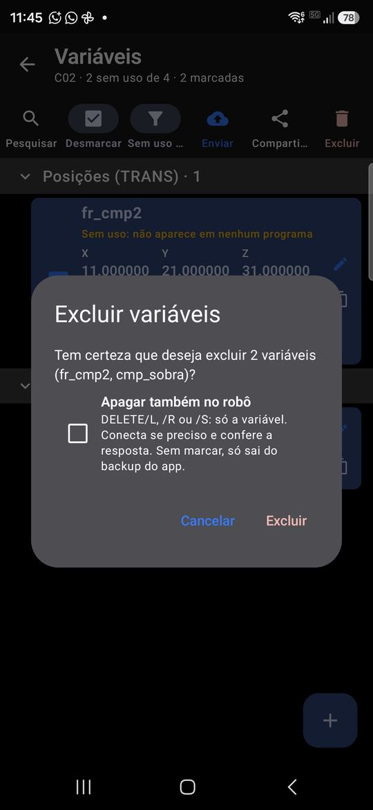

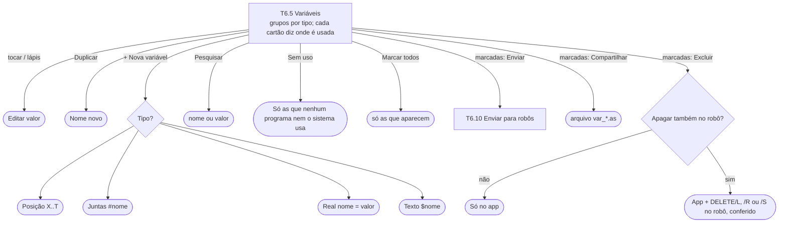
```mermaid
flowchart TD
    V["T6.5 Variáveis<br/>grupos por tipo; cada cartão diz onde é usada"]
    V -->|"tocar / lápis"| E1(["Editar valor"])
    V -->|"Duplicar"| E2(["Nome novo"])
    V -->|"+ Nova variável"| N{"Tipo?"}
    N --> N1(["Posição X..T"])
    N --> N2(["Juntas #nome"])
    N --> N3(["Real nome = valor"])
    N --> N4(["Texto $nome"])
    V -->|"Pesquisar"| S1(["nome ou valor"])
    V -->|"Sem uso"| SU(["Só as que nenhum programa nem o sistema usa"])
    V -->|"Marcar todos"| M1(["só as que aparecem"])
    V -->|"marcadas: Enviar"| EN["T6.10 Enviar para robôs"]
    V -->|"marcadas: Compartilhar"| C1(["arquivo var_*.as"])
    V -->|"marcadas: Excluir"| X{"Apagar também no robô?"}
    X -->|"não"| X1(["Só no app"])
    X -->|"sim"| X2(["App + DELETE/L, /R ou /S no robô, conferido"])
```

✏️ **Revisão T6.5:**

### T6.6 Data Bank

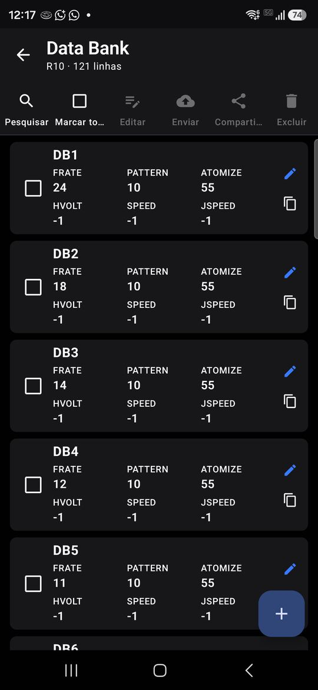 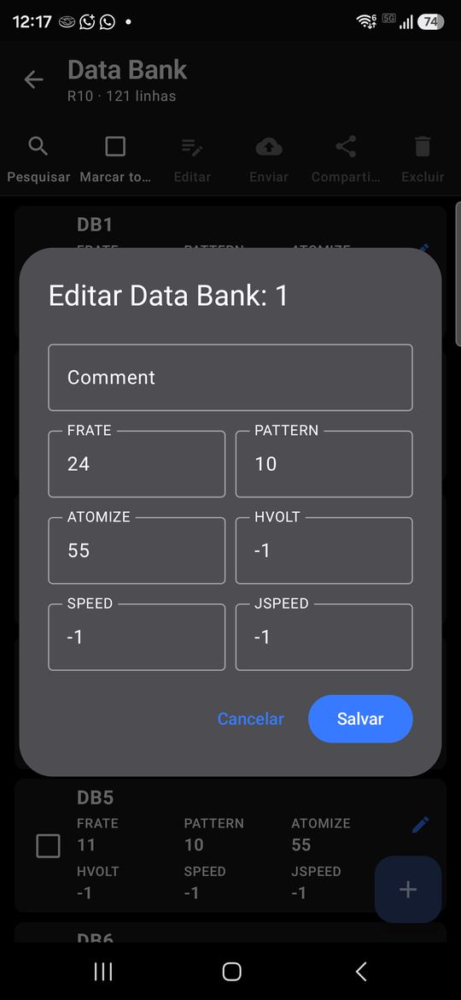 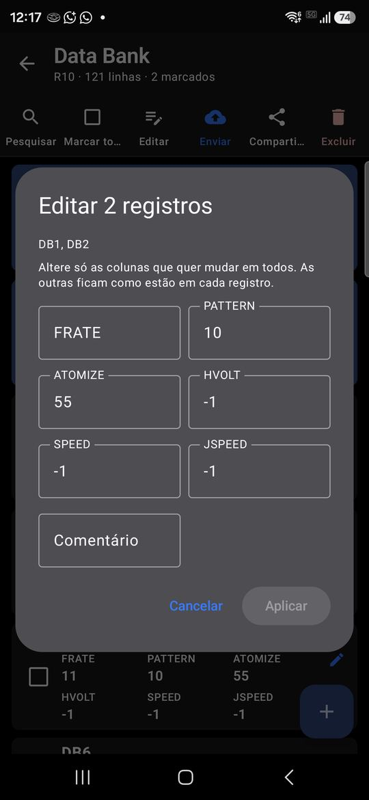

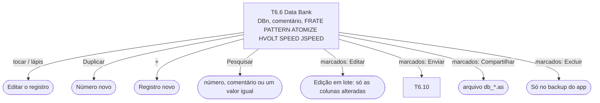
```mermaid
flowchart TD
    D["T6.6 Data Bank<br/>DBn, comentário, FRATE PATTERN ATOMIZE HVOLT SPEED JSPEED"]
    D -->|"tocar / lápis"| E1(["Editar o registro"])
    D -->|"Duplicar"| E2(["Número novo"])
    D -->|"+"| E3(["Registro novo"])
    D -->|"Pesquisar"| S1(["número, comentário ou um valor igual"])
    D -->|"marcados: Editar"| B(["Edição em lote: só as colunas alteradas"])
    D -->|"marcados: Enviar"| EN["T6.10"]
    D -->|"marcados: Compartilhar"| C1(["arquivo db_*.as"])
    D -->|"marcados: Excluir"| X(["Só no backup do app"])
```

✏️ **Revisão T6.6:**

### T6.7 Logs (Erros, Operação, Edição)

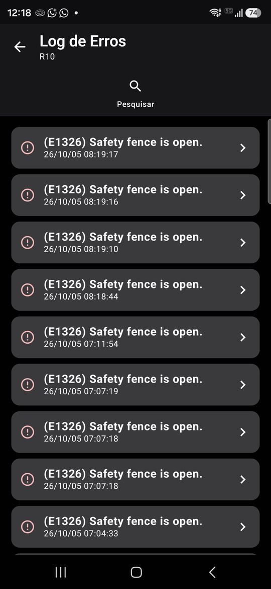 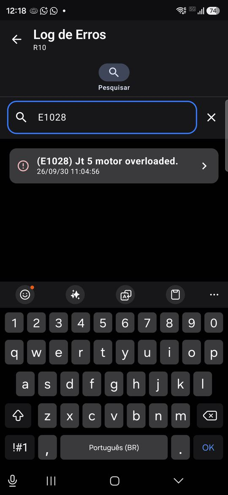 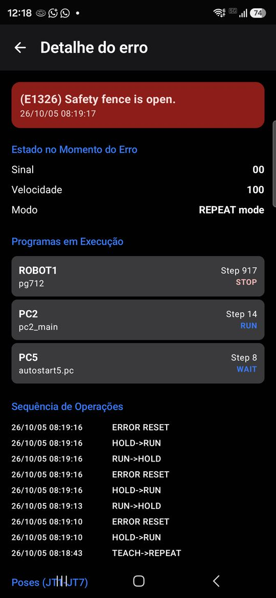 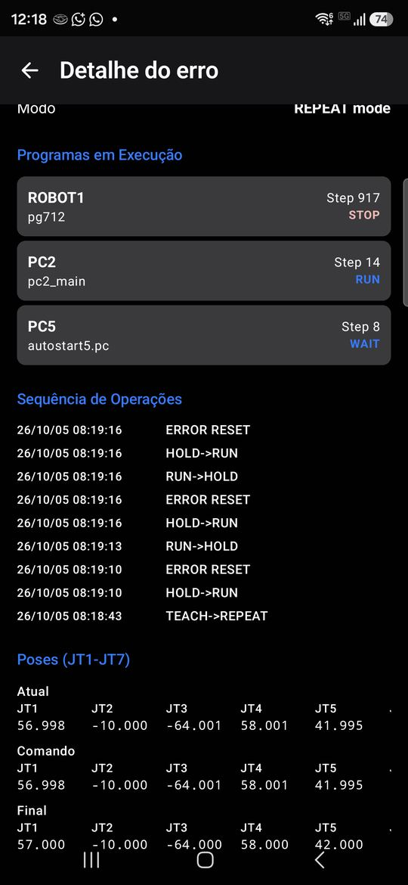

 

- Só com backup SAVE/FULL; sem ele aparecem zerados com a explicação.
- **Erros:** código, mensagem, data; tocar abre o detalhe (estado no momento, programas em
  execução, sequência de operações, poses, texto original).
- **Operação** e **Edição:** uma linha por evento.
- **Pesquisar** em qualquer parte do texto.

✏️ **Revisão T6.7:**

### T6.8 Terminal do robô


```mermaid
flowchart TD
    T["T6.8 Terminal"]
    T -->|"digitar"| K(["Cada tecla vai na hora; apagar = backspace"])
    T -->|"Enviar com campo vazio"| K2(["Enter em branco: responde Change?"])
    T -->|"⬆ / ⬇"| K3(["Histórico do controlador"])
    T -->|"raio"| T7["T7 Comandos rápidos"]
    T -->|"Conectar / Desconectar"| K4(["conexão"])
    T -->|"Arquivos"| K5(["Pasta dos .as no gerenciador de arquivos"])
    T -->|"Limpar"| K6(["Limpa a tela"])
    T -->|"SAVE digitado"| K7(["Arquivo na pasta: vira backup só na sincronização"])
    T -->|"LOAD digitado"| K8(["Lê o arquivo da pasta do robô"])
```

✏️ **Revisão T6.8:**

### T6.9 Comparar com o robô

  

  


```mermaid
flowchart TD
    C["T6.9 Comparar"]
    C --> O{"OFFLINE"}
    O -->|"padrão"| O1(["o backup que o painel mostra"])
    O -->|"Trocar"| O2(["outro backup do robô"])
    C --> R{"ROBÔ"}
    R -->|"padrão: Agora"| R1(["conecta + SAVE/FULL, vira backup"])
    R -->|"Trocar"| R2(["um backup escolhido"])
    C -->|"Comparar"| RES["Resultado"]
    RES --> G1["SÓ NO ROBÔ: caixa em cada item"]
    RES --> G2["DIFERENTES"]
    G2 -->|"tocar no programa"| DF(["Linhas que mudam: − offline, + robô<br/>Mostrar tudo / Só as diferenças"])
    RES --> G3(["SÓ NO OFFLINE: mandar pelo Enviar"])
    RES --> G4(["IGUAIS: só a contagem"])
    G1 -->|"Apagar no robô N"| X1{"Confirma a lista de comandos?"}
    X1 -->|"sim"| X2(["Apaga um por um, conferido<br/>janela com ✓ / ✗"])
    X2 -->|"Comparar de novo"| RES
```

✏️ **Revisão T6.9:**

### T6.10 Enviar para robôs


```mermaid
flowchart TD
    E["T6.10 Lista de robôs por projeto<br/>LED, estado, série"]
    E -->|"marcar um ou mais / Marcar todos do projeto"| E1["Enviar para N robôs"]
    E1 --> E2["Em cada robô, ao mesmo tempo:<br/>conecta, login, checagens, prompt livre"]
    E2 --> E3["LOAD conferido"]
    E3 --> E4{"Arquivo inteiro e 0 errors?"}
    E4 -->|"sim"| E5(["✓"])
    E4 -->|"não"| E6(["✗ com o motivo"])
```

O LOAD substitui sem perguntar um programa que já existe no robô.

✏️ **Revisão T6.10:**

---

## T7. Comandos rápidos

 

- Lista de botões de comando do robô. **Tocar** envia e volta ao terminal; **editar**,
  **excluir**, **"+"** novo.
- `[ROBOT]` = nome do robô, `[DATA]` = data e hora.
- Padrão da Kawasaki: SAVE (FULL, P, L, R, S, SYS, ROB, ALLLOG), Load File (o `[FILE]` não
  funciona), ID, FREE, TYPE TASK, ERESET, HOLD, CONTINUE, ZPOW ON/OFF, SPEED 50, ABORT, KILL,
  PCABORT 1:, PCKILL 1:, DIR.

✏️ **Revisão T7:**

---

## T8. Editor de programas

   

   

  


```mermaid
flowchart TD
    E["T8 Editor<br/>cores do AS, número da linha"]
    E -->|"Pesquisar"| P["Barra de pesquisa"]
    P --> P1(["◀ ▶ entre as ocorrências, N de M"])
    P -->|"ícone de lista"| P2(["Pesquisa rápida: termos de T4 com a contagem"])
    E -->|"Editar"| M["Modo de edição: caixa em cada linha"]
    M -->|"Marcar"| M1(["todas / limpar / para cima / para baixo / entre 2"])
    M -->|"Copiar 1+"| M2(["área de transferência do Android"])
    M -->|"Colar 1"| M3(["entra acima da marcada"])
    M -->|"Linha 1"| L{"O que fazer?"}
    L -->|"Editar"| L1{"Instrução conhecida?"}
    L1 -->|"sim"| L2(["Campo por campo, como o CHANGE do pendant"])
    L1 -->|"não"| L3(["Texto livre"])
    L -->|"Inserir"| L4(["Linha nova no lugar; as de baixo descem"])
    L -->|"Adicionar"| L5(["Linha nova depois"])
    M -->|"Excluir 1+"| M4(["apaga as linhas"])
    M -->|"Desfazer / Refazer"| M5(["cada alteração"])
    M -->|"Substituir"| S["Campo Substituir por"]
    S -->|"Substituir"| S1(["atual e vai para a próxima"])
    S -->|"Todos"| S2(["todas: N substituições em M linhas"])
    E -->|"segurar uma linha"| L1
    E -->|"Salvar"| SV{"Arquivo de onde?"}
    SV -->|"backup inteiro"| SV1(["grava o backup no app e na pasta"])
    SV -->|"um programa"| SV2(["troca só aquele bloco no backup"])
    SV -->|"arquivo externo"| SV3(["Salvar em: escolher o robô"])
    E -->|"⋮ Conversão de programa"| CV{"Linhas marcadas de 1 programa"}
    CV --> CV1(["Deslocar pontos: delta em X..T e eixos externos"])
    CV --> CV2(["Espelhar pontos: X, Y ou Z"])
```

Salvar não manda nada ao robô; para mandar, é o **Enviar** do painel.

✏️ **Revisão T8:**

---

## T9. Histórico de backups

  


```mermaid
flowchart TD
    H["T9 Histórico<br/>busca, Mais novos / Mais antigos"]
    H -->|"Ler pasta"| H1(["importa .as novos da pasta"])
    H -->|"tocar"| T6["T6 Painel com esse backup"]
    H -->|"Ver código"| T8["T8 Editor"]
    H -->|"Duplicar"| H2(["cópia com outro nome"])
    H -->|"Compartilhar"| H3{"Como?"}
    H3 --> H31(["Exportar para uma pasta"])
    H3 --> H32(["Outro app: WhatsApp, e-mail…"])
    H -->|"Excluir"| H4(["do app e da pasta, com confirmação"])
    H -->|"+"| H5{"Criar backup"}
    H5 -->|"Baixar do robô conectado"| T68["T6.8 Terminal"]
    H5 -->|"Importar"| H6(["um .as do celular, até 20 MB"])
```

✏️ **Revisão T9:**

---

## T10. Tela de Projeto (cabine)

   

  

 

   

  


```mermaid
flowchart TD
    P["T10 Projeto: grade da cabine"]
    P -->|"tocar no robô"| P1(["conecta / desconecta"])
    P -->|"segurar no robô"| T6["T6 Painel"]
    P -->|"Conectar todos / Desconectar"| P2(["todos do projeto"])
    P -->|"Terminal Geral"| T11["T11"]
    P -->|"⋮ Renomear projeto"| P3(["nome novo"])
    P -->|"⋮ Mestre / Escravo"| T5["T5"]
    P -->|"Editar layout"| EL["Modo de edição"]
    EL --> EL1(["tocar robô + vaga: move; robô + robô: troca"])
    EL --> EL2(["Tirar do layout / Posicionar todos"])
    EL --> EL3(["+ coluna, Adicionar linha, − linha ou coluna vazia"])
    EL --> EL4(["Adicionar equipamento: Transportador ou Outro"])
    EL -->|"Salvar / Descartar"| P
    P --> AG["Ações em grupo: lista de robôs, todos marcados"]
    AG --> AG1(["Backup de todos: SAVE/FULL conferido"])
    AG --> AG2(["Comando: o mesmo em cada robô"])
    AG --> DU["Duplicar programa"]
    DU --> DU1["Escolher: ORIGEM, CÓPIA, comentário, FRAME DA BASE, robôs"]
    DU1 --> DU2["Conferir por robô: será criado / SERÁ SUBSTITUÍDO / frame"]
    DU2 --> DU3(["LOAD conferido em cada robô"])
    P --> MS["Desenho mestre / escravo"]
    MS -->|"Configurar"| T5
    MS -->|"Transferir"| TR1["Escolher: ORIGEM, DESTINO, opções, programas"]
    TR1 -->|"Analisar"| TR2["Conferir por par: programas, BASE que muda, frames"]
    TR2 -->|"Transferir / mesmo assim"| TR3(["LOAD conferido em cada escravo"])
    P --> MT["Mini terminais: últimas linhas + andamento"]
    MT -->|"tocar"| T68["T6.8 Terminal do robô"]
```

✏️ **Revisão T10:**

---

## T11. Terminal Geral

 

- O que se digita, ou um comando rápido, vai para **todos os robôs conectados do projeto**.
- **Conectar** liga todos (janela com o andamento); **Desconectar**; **Limpar**.
- A tela mostra só o que foi enviado; a resposta de cada robô fica no terminal dele.

✏️ **Revisão T11:**

---

## T12. Arquivo de outro app

- Um `.as` ou `.pg` aberto pelo "Abrir com" abre no editor (T8) sem virar backup.
- **Salvar em…** pergunta em qual robô guardar. Arquivo acima de 20 MB ou que não é texto é
  recusado.

✏️ **Revisão T12:**

---

## O. Observações de usabilidade que eu já notei

Para você concordar, discordar ou completar (escreva ao lado de cada uma).

| Código | Observação |
|---|---|
| O1 | **Conectar em muitos lugares:** cartão da lista, faixa do projeto, home do painel, terminal, Tela de Projeto (tocar no robô), Terminal Geral. Cada um com nome e jeito um pouco diferentes. |
| O2 | **Funções importantes escondidas:** "Comparar com o robô" e "Histórico" ficam no cartão "Backup analisado", no meio da home; "Ver arquivo completo" fica só no ⋮. |
| O3 | **Home do painel muito longa:** os atalhos (Programas, Variáveis, Data Bank, Logs) ficam no fim, depois de cartão, status, uso e backup. |
| O4 | **Duas formas de baixar backup:** "Atualizar" no painel (automático e conferido) e "+ Baixar do robô conectado" no Histórico (só abre o terminal). |
| O5 | **Rota sem botão:** existe uma tela de "variáveis no editor" (`variable_viewer`) que nenhum botão abre mais. |
| O6 | **Barra de ações cheia:** em Variáveis são 6 ações; nomes ficam cortados ("Marcar to…", "Compartilh…"). |
| O7 | **Excluir diferente em cada lista:** Programas e Variáveis perguntam se apaga no robô; Data Bank e Histórico só no app. |
| O8 | **Três tipos de terminal:** do robô (completo), Terminal Geral (só o enviado) e mini terminais (5 linhas). |
| O9 | **Comandos rápidos em inglês** ("Save Full Backup", "Error Reset") num app em português. "Load File" não funciona. |
| O10 | **Mestre / Escravo em três lugares:** ⋮ da lista, ⋮ do projeto e o desenho do projeto. |
| O11 | **Comparar só apaga:** o que está "só no offline" ou "diferente" precisa ir para Programas/Variáveis e usar Enviar. |
| O12 | **SAVE digitado no terminal** não vira backup na hora (só ao abrir a lista ou em "Ler pasta"). |
| O13 | **Nomes de backup** aparecem com o prefixo "Sinc:" (ex.: "Sinc: C02_20261006_1143.as"). |
| O15 | **Arquivos de envio no Histórico:** `dup_pg761.as` aparece como backup no Histórico (o painel já os esconde). |
| O16 | **`comment___` na lista de programas** do Transferir e do Duplicar (é um bloco interno do controlador; o painel já o esconde). |
| O17 | **"Sem sinal" logo depois de conectar:** o pulso é passivo; um robô quieto há 8 s aparece amarelo mesmo estando bem (visto no C02 ao conectar). |
| O18 | **Terminal Geral vazio:** a tela fica preta até alguém mandar algo; não mostra quem está conectado nem as respostas. |
| O19 | **Variáveis do sistema (`!gun1`…) no topo da lista** de Posições, antes das do usuário. |
| O20 | **Botões de janela colados na barra do Android:** no editar robô, o "Cancelar" fica junto da barra de navegação e é fácil tocar no Início. |
| O14 | **Telas sem ponto de partida claro** para tarefas do dia a dia: "fazer backup de tudo", "mandar um programa para 3 robôs", "ver o que mudou". |

✏️ **Revisão O:**

---

## N. Rascunho de nova organização (para discutir)

Só uma ideia de partida; mude à vontade.


```mermaid
flowchart TD
    A["Início: lista de robôs e projetos"] --> B["Robô"]
    A --> C["Projeto / cabine"]
    B --> B1["Visão geral<br/>conexão, status, uso, memória"]
    B --> B2["Arquivos do robô<br/>Programas, Variáveis, Data Bank, Logs, Código"]
    B --> B3["Sincronizar<br/>Atualizar, Comparar, Enviar, Histórico"]
    B --> B4["Terminal<br/>+ comandos rápidos"]
    C --> C1["Cabine: grade e conexão"]
    C --> C2["Ações em grupo<br/>backup, comando, duplicar, transferir"]
    C --> C3["Terminais"]
    A --> D["Configurações<br/>Fabricantes, Mestre / Escravo, Pasta, Wi-Fi"]
```

- **Robô com 4 abas fixas** (Visão geral, Arquivos, Sincronizar, Terminal) no lugar da home
  longa com atalhos no fim.
- **Sincronizar** junta tudo que conversa com o robô sobre arquivos: Atualizar, Comparar
  (com Enviar e Apagar), Enviar e Histórico.
- **Configurações** num lugar só.

✏️ **Revisão N:**
