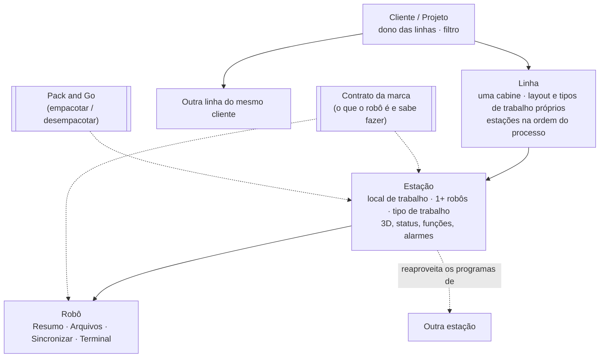

# Plano mestre do MyRobots

> Documento vivo. **Marque `[x]` quando terminar** e escreva a data e o commit ao lado.
> Atualizado em 07/10/2026 (várias linhas por cliente) a partir da branch `melhorias/v1.2` (último commit `48c9785`).
>
> Detalhes técnicos que já existem **não são repetidos aqui**, só referenciados:
> - `docs/PLANO_V1_2.md`: fases 0, 0-B, 0-C, 1, 1.5 e 2, com passos, migrações e testes.
> - `docs/FLUXO_APP.md`: cada tela atual (T1…T12), fotos em `docs/telas/` e as revisões de
>   usabilidade (O1…O20, decisões D1…D8, fases R1…R6).
> - `docs/KIDE_COMANDOS.md`: comandos que o KIDE usa (base da biblioteca da Kawasaki).
>
> Legenda: `[x]` feito · `[~]` em andamento ou feito sem teste no aparelho · `[ ]` a fazer ·
> 🆕 = decidido nas conversas de 06–07/10 (ainda não está em nenhum outro documento).

---

## 1. Visão geral: a espinha do app

- **Quatro níveis para navegar:** Cliente → Linha → Estação → Robô.
- **Um cliente pode ter várias linhas.** Exemplo real: a Honda tem mais de uma cabine, cada uma com
  um layout diferente e tipos de robô e de trabalho diferentes (uma de pintura, outra de manipulação).
  Cada linha tem as estações dela.
- **Atalho:** se o cliente tem uma linha só, o app abre direto nas estações dela, sem a tela
  intermediária. O mesmo vale quando existe um cliente só.
- **Processo não é um nível:** ele vive dentro de **cada Linha** e define:
  - a **ordem** em que as estações aparecem na Linha;
  - os **filtros**;
  - as **ligações de reaproveitamento** entre estações (também entre linhas diferentes do mesmo cliente, com aviso). É o mestre/escravo de hoje, renomeado para
    "**reaproveita os programas de**".
- **As ligações são só trabalho de arquivo OFFLINE pelo app:** copiar, duplicar e transferir
  programas, base e frames. O app **não** entra no online do equipamento nem na comunicação entre
  robôs durante a produção. Isso está **fora de escopo**.
- **Dois serviços atravessam tudo:**
  - **Contrato da marca** (`RobotCapabilities`): o que cada robô é e o que sabe fazer. As telas só
    perguntam ao contrato, para Fanuc, ABB e Universal entrarem depois **sem mexer nas telas**.
  - **Pack and Go**: leva uma estação inteira num arquivo só.

## 2. Regras gerais (valem para todas as telas)

- [ ] 🆕 **Tipo de trabalho da estação é uma lista aberta.** Começa com Pintura, Solda, Manipulação
      e Selagem, e dá para criar tipos novos nas Configurações.
- [ ] 🆕 **Ocultar sem apagar.** Um cliente, linha ou estação antigo some da tela inicial, mas os backups
      e as configurações continuam guardados. Liga e desliga quando quiser.
- [ ] 🆕 **Filtros** numa seção própria: cliente, **linha**, marca do robô, tipo de trabalho, data
      (último backup, criação), status e o que mais for útil.
- [ ] **Paleta fixa** (D8): desligar as cores dinâmicas do Android 12+. Verde, amarelo e vermelho
      ficam só para status.
- [ ] **Nomes em português** (D7): sem "Sinc:", "No app / No robô", "Backup em uso".
- [ ] **Um só caminho de envio** (D3): Escolher → Conferência → Enviar → Resultado ✓/✗ por robô.
- [ ] **Um só jeito de excluir** (D4): "Apagar também no robô" em Programas, Variáveis e Data Bank.
- [ ] **Itens do sistema recolhidos e por último** (D6): `!…`, `autostart*`, `comment___`.
- [ ] **Uma só peça de conexão** (D2): LED, estado e toque para conectar, igual em todo lugar.
- [ ] **Formulários longos em tela cheia** e botões acima da barra do Android (D5).

## 3. Pack and Go 🆕

- Exporta uma **estação**, uma **linha** inteira ou um **cliente** num **arquivo único**: backups de cada robô,
  layout, equipamentos, ligações, comandos e configurações.
- Importar é o caminho contrário: o arquivo é desempacotado e a estação aparece **pronta e
  funcionando**, como uma mala fechada.
- **Tela de opções antes de empacotar** (caixas de marcar):
  - [ ] incluir senhas de login (sim/não);
  - [ ] incluir arquivos 3D e fotos (sim/não);
  - [ ] backups: histórico completo **ou** só o último de cada robô.
- **Regra de ouro:** o que foi marcado para ir vai **completo**. Quem recebe roda igual, sem
  configurar mais nada.
- **Compatibilidade para trás (regra firme):** o pacote carrega a versão do formato. **Toda versão
  futura do app abre qualquer pacote antigo**, limitada ao que existia na época. Toda mudança no
  formato vem com teste de um pacote antigo.
- **Base técnica:** usa o mesmo formato dos arquivos `robo.myrobots` e `projetos.myrobots` da
  Fase 1.5. O Pack and Go é a pasta da estação, com esses arquivos, compactada com um manifesto.
  Por isso a **Fase 1.5 vem antes**.

---

## 4. Status atual

### Feito

- [x] **Fase 0**, segurança: migrações reais, schema exportado, sem backup falso, rename `Logs → Terminal`.
- [~] **Fase 0-B**, Play e segurança: armazenamento (MediaStore + pasta escolhida), nomes de
      arquivo seguros, "abrir com" validado, senha cifrada com Keystore. **Falta testar no aparelho.**
- [~] **Fase 0-C**, testes: parsers AS, `PointTransform`, `ExternalAsFile`, `StoredSecret`.
      **Falta rodar o `MigrationTest`.**
- [~] **Fase 1**, navegação: o toque no robô abre o painel; LED compartilhado. Passos 1 a 3 feitos,
      **falta testar o 3 no aparelho**.
- [x] **Fase 2.1**, cabine visual: tela de Projeto, grade, editor de layout e equipamentos (banco v5).
- [x] Série do robô e checagens do login (ID, TIME, FREE), banco v6.
- [x] Pares mestre/escravo de robôs e projetos (banco v7), tela Mestre/Escravo com offset e frame.
- [x] Transferir mestre → escravo com conferência; Duplicar programa em grupo; Backup de todos;
      Comando para todos; mini terminais.
- [x] Painel do robô: cartão do controlador, status geral, por eixo, uso (gráfico + Excel),
      memória, "Atualizar" (SAVE/FULL conferido), Histórico.
- [x] Comparar com o robô; variáveis sem uso; apagar no robô conferido.
- [x] Editor: Alterar por instrução, Inserir, Substituir, pesquisa rápida, Deslocar/Espelhar.
- [x] Variáveis e Data Bank em cartões, com envio em lote; Data Bank com edição em lote.
- [x] Ponte Wi-Fi do K-ROSET (portas 2301–2309); escuta KIDE ↔ K-ROSET; biblioteca de comandos.
- [x] LOAD que não trava o controlador + protocolo de testes; barra do topo padronizada.
- [x] `docs/FLUXO_APP.md` com as 87 fotos.

### Pendente (já conhecido)

- [ ] Testes no aparelho da Fase 0-B (pasta, "abrir com", senha, migração da pasta antiga).
- [ ] Rodar o `MigrationTest` (v4 → v7) no aparelho.
- [ ] **Fase 1.5**, pasta autossuficiente. Só o plano existe, nada de código.
- [ ] Fase 2.0 (infraestrutura do terminal) e o que resta da 2.2: confirmar no `PLANO_V1_2.md` o que
      já foi coberto pelos commits de 02 a 05/10.
- [ ] 0-B.D: acentos nos arquivos AS (precisa de um SAVE/FULL real).
- [ ] 0-B.F: Play Console (política de privacidade, Data Safety). É com você.
- [x] Colocar no repositório o `FLUXO_APP.md` revisado (com as propostas de 06/10). `ffc6f36`, 07/10/2026.
- [ ] Revisão de segurança da senha aberta no `robo.myrobots` (aceita em 01/10; rever antes da release).

### Perguntas em aberto

- [ ] Regra do INZONE: quais movimentos contam como "movimento antes"?
- [ ] "Copiar a base": formato da BASE no SAVE/FULL e se robôs de lados opostos têm base diferente.
- [ ] LOAD sobre programa existente: o controlador pede confirmação?
- [ ] Mais de um equipamento por cabine (o banco já aceita; confirmar o uso).
- [ ] Limite de "backup antigo": 7 dias?
- [x] 🆕 Pode existir mais de uma Linha por Cliente? **Sim** (respondido em 07/10, exemplo da Honda).

---

## 5. Plano por fases (na ordem de fazer)

> Cada fase deixa o app funcionando. Uma não desmancha o que a anterior fez.
> Ao terminar uma fase: testar no aparelho, atualizar o `GUIDE.md` e marcar aqui.

### Fase A: fechar a base atual (antes de qualquer reestruturação)

- [ ] A1. Testes no aparelho da 0-B e da Fase 1 passo 3.
- [ ] A2. `MigrationTest` v4 → v7.
- [ ] A3. **Ajustes rápidos (R1 do FLUXO_APP):**
  - [ ] tirar o "Sinc:" dos nomes (O13);
  - [ ] esconder `dup_*.as` no Histórico (O15);
  - [ ] tirar `comment___` das listas (O16);
  - [ ] itens de sistema por último (O19, D6);
  - [ ] botões acima da barra do Android (O20);
  - [ ] comandos rápidos em português e sem "Load File" (O9);
  - [ ] apagar a rota `variable_viewer` (O5);
  - [ ] tirar o "olho" da lista de programas;
  - [ ] "Salvar / ✓ Salvo" no editor;
  - [ ] "Não perguntar de novo" no relógio (G2);
  - [ ] regra nova do "Sem sinal": amarelo só se o robô não responder a algo enviado (O17).

### Fase B: isolar o Contrato da marca

> Vem antes da hierarquia nova porque quase todas as telas dependem dele. Não muda nada na tela.

- [ ] B0. **Levantamento:** gerar `docs/ACOPLAMENTO_KAWASAKI.md` com cada lugar, **fora** da camada
      da marca, onde a Kawasaki está grudada. Procurar: `SAVE/`, `LOAD`, `DELETE/`, `.PROGRAM`/`.END`,
      `.sprdb`, `.TRANS`/`.REALS`/`.STRINGS`, `FRATE`/`PATTERN`/`ATOMIZE`/`HVOLT`,
      `.ERRLOG`/`.OPELOG`/`.PGM_EDT_LOG`, porta `23`, textos em inglês e `when (manufacturer)`.
      Para cada achado: arquivo, linha, o que é e para onde vai.
- [ ] B1. **Definir o contrato** (`RobotCapabilities`, em `:core:model`):
  - **O que o robô é:** porta padrão, como faz login, **tipos de arquivo que tem** (Programas,
    Variáveis por tipo, Data Bank, Logs…), tipos de variável, grupos de programa.
  - **O que o robô sabe fazer:** backup completo, enviar arquivo, apagar programa/variável, ler
    status, ler memória, ler série, achar início/fim de programa no backup, ler cada log.
  - **Biblioteca:** comandos rápidos padrão e termos da pesquisa do editor.
  - **Regra:** se a resposta muda de uma marca para outra, é contrato. Se é igual para todas, fica na tela.
- [ ] B2. Criar `KawasakiCapabilities` movendo para ele o que o B0 achou. Nenhuma tela muda de aparência.
- [ ] B3. A aba Arquivos monta os quadrados a partir da lista do contrato, e não de uma lista fixa.
- [ ] B4. **Critério de pronto:** para uma marca nova, os arquivos a criar são **só a biblioteca
      nova**. Registrar a resposta no `ACOPLAMENTO_KAWASAKI.md`.
- Fora de escopo: implementar Fanuc, ABB e Universal. Elas entram quando houver um robô real.

### Fase C: hierarquia Cliente → Linha → Estação 🆕

- [~] C1. Banco v8:
  - tabela `clients` (nome, `hidden`, ordem);
  - tabela `lines` (`clientId`, nome, `hidden`, ordem). O **processo** é desta tabela: a ordem das
    estações e as ligações valem dentro da linha;
  - `projects` vira **estação** (`stations`), com `lineId`, `workTypeId`, `sortOrder` (a ordem
    do processo) e `hidden`;
  - tabela `work_types`, já com Pintura, Solda, Manipulação e Selagem;
  - as ligações mestre/escravo continuam, renomeadas para "reaproveita os programas de". Valem
    **dentro da mesma linha** e também **entre linhas diferentes do mesmo cliente** (decidido em
    07/10). A tabela de ligações guarda as duas estações, sem exigir que estejam na mesma linha.
  - Migração 7 → 8: cada projeto atual vira uma estação, dentro de uma linha "Linha 1" de um
    cliente "Meu cliente". Os pares mestre/escravo atuais viram ligações dessa linha.
      **08/10/2026, `8d45090`:** feito; a estação continua sendo `project_layouts` (sem tabela `stations`) e as ligações continuam em `masterProject`. Falta rodar o `MigrationTest` no aparelho.
- [~] C2. Ocultar e mostrar cliente, linha ou estação (nada é apagado). Os ocultos ficam numa lista
      própria nas Configurações.
      **08/10/2026, `cb1fe7f`:** feito; os ocultos ficam em "Mostrar ocultos" na própria tela (cliente, linha e estação), não nas Configurações.
- [~] C3. Seção de **filtros**: cliente, linha, marca, tipo de trabalho, data, status.
      **08/10/2026, `cb1fe7f`:** tipo de trabalho, linha, status e marca. Filtro por cliente e por data ainda não.
- [~] C4. Tipos de trabalho editáveis nas Configurações.
      **08/10/2026, `cb1fe7f`:** só criar ("Novo tipo…" no ⋮ da estação). Renomear e apagar tipos nas Configurações ainda não.
- [ ] C5. Atualizar o `GUIDE.md` e o `FLUXO_APP.md` (Projeto → Estação, com Cliente e Linha acima).

### Fase D: pasta autossuficiente (Fase 1.5 do PLANO_V1_2)

> Depois da C, para os arquivos já nascerem com cliente, estação e tipo de trabalho.

- [ ] D1. `Robot.uuid` + migração.
- [ ] D2. `robo.myrobots` e `projetos.myrobots` (agora com cliente, linha, estação, tipo, ordem,
      oculto e ligações), com `formatVersion` e checksum.
- [ ] D3. `MetadataMirror`: o banco manda, a pasta acompanha; cópia `.bak`.
- [ ] D4. Restaurar: tela de boas-vindas, seletor já em `Documentos/MyRobots`, resumo e importação.
- [ ] D5. Teste: usar → desinstalar → reinstalar → restaurar → tudo volta.

### Fase E: Robô em 4 abas + envio e exclusão iguais (R2 e R3)

- [ ] E1. Robô com abas fixas: **Resumo**, **Arquivos**, **Sincronizar** e **Terminal**.
- [ ] E2. "Backup em uso" com data e Trocar; Histórico novo (data como título, ⋮, agrupado por mês).
- [ ] E3. **Conferência única** (D3) também no Enviar do painel (hoje ele substitui sem avisar).
- [ ] E4. Comparar com Enviar, Trazer e Apagar em todos os grupos.
- [ ] E5. Exclusão igual em todas as listas (D4).

### Fase F: Linha e Estação 🆕

- [~] F0. **Tela inicial = Clientes:** cada cliente com as linhas dele e um resumo (ativos e
      alarmes). Tocar abre o cliente. Com um cliente só, abre direto nele.
      **08/10/2026, `cb1fe7f`:** feito, com atalhos de um cliente e de uma linha. Sem alarme ao vivo: mostra só os conectados.
- [~] F0b. **Cliente:** as linhas (cabines) dele, cada uma com uma mini-planta, o tipo de trabalho
      e o resumo. Com uma linha só, abre direto nela.
      **08/10/2026, `cb1fe7f`:** feito.
- [~] F1. **Linha:** estações na ordem do processo, mini-cabine com uma cor por
      robô, ativos e alarmes, setas de "reaproveita os programas de". Filtros no topo.
      **08/10/2026, `cb1fe7f`:** feito sem 3D: mini grade com um quadrado por robô na cor do status, ligações e Transferir. Filtros só na tela inicial.
- [ ] F2. **Estação:** cabine em 3D, chips de status, **Funções** (Backup de todos, Comando para
      todos, Duplicar, Transferir) e **Alarmes**.
- [ ] F3. **3D:** carregar um `.glb` de braço robótico genérico com SceneView/Filament. Começa como
      efeito visual: anel de status no chão, movimento quando ativo, pisca em alarme. No futuro, os
      ângulos dos eixos podem vir do robô. Se o aparelho não suportar 3D, mostrar a grade 2D atual.
- [ ] F4. Remover o Terminal Geral (o "Comando para todos" já mostra a resposta de cada robô) (O8, O18).
- [ ] F5. Ligações em linhas compactas; tirar o texto "→ C01 → R16" dos cartões.
- [~] F6. 🆕 **Reaproveitar entre linhas diferentes** (mesmo cliente):
  - dentro da mesma linha: ligação natural, sem aviso extra;
  - entre linhas diferentes: ao **criar a ligação** e ao **executar** (Transferir, Duplicar para
    outra linha), mostrar o alerta "Atenção: esta linha é diferente e não está no mesmo processo.
    Tem certeza que deseja reaproveitar/transferir?" com **Cancelar** e **Continuar mesmo assim**;
  - na Conferência, uma faixa amarela fixa "Origem e destino em linhas diferentes" acima da lista;
  - na tela da Linha, a ligação para outra linha aparece com a etiqueta da linha de destino
    (ex.: "→ Honda · Cabine 2"), com o traço diferente da ligação interna.
      **08/10/2026, `cb1fe7f`:** aviso ao transferir e ao criar ou trocar o mestre em Mestre / Escravo; faixa amarela na conferência; ⇄ amarelo e seção tracejada na Linha. O Duplicar é dentro de uma estação, então não cruza linhas.

### Fase G: Nova estação + Perfil da marca + Configurações 🆕

- [ ] G1. **Assistente de Nova estação** (nunca se cadastra um robô solto):
      1) Cliente, linha e estação (nome, tipo de trabalho), escolhendo os que existem ou criando novos → 2) Marca (sem suporte = "em breve") →
      3) Layout (tamanho, transportador) → 4) Robôs (nome, IP e **Testar**, que conecta, faz login e lê a série).
- [ ] G2. **Perfil da marca** (configurações avançadas), lendo o contrato: tipos de variável, tipos
      e grupos de programa, logs disponíveis, comandos padrão e pesquisa do editor. Substitui a
      tela "Fabricantes".
- [ ] G3. **Configurações** pela engrenagem: Perfil da marca, Tipos de trabalho, Pasta dos arquivos,
      Wi-Fi, Ocultos, Tema, Restaurar.

### Fase H: Pack and Go 🆕

- [ ] H1. Formato do pacote: manifesto com `formatVersion`, a versão do app e a lista do que vai
      dentro, mais as pastas da estação no formato da Fase D.
- [ ] H2. Tela de opções: senhas, 3D/fotos, histórico completo ou último backup.
- [ ] H3. Exportar: compartilhar pelo Android ou salvar numa pasta.
- [ ] H4. Importar: abrir o arquivo → resumo → criar o cliente e a estação prontos. Se já existir,
      perguntar se substitui ou cria uma cópia.
- [ ] H5. Testes de compatibilidade: guardar pacotes de exemplo de cada versão do formato em
      `core/.../test/resources/packs/` e garantir que todos continuam abrindo.

### Fase I: listas e logs (R6)

- [ ] I1. Variáveis compactas e com chips de filtro (Todas, Sem uso, Posições, Juntas, Reais, Textos).
- [ ] I2. Data Bank em formato de planilha.
- [ ] I3. Log de Erros agrupado (×N) e com filtro por gravidade.
- [ ] I4. Log de Edição em campos; tocar abre o editor no programa e no step.
- [ ] I5. Comandos agrupados por categoria.
- [ ] I6. Editor: barras recolhíveis; ações de edição só com linha marcada; rolagem lateral
      sincronizada. **Combinar com o agente do Android Studio** (`.agent/plan.md`), que já está mexendo nisso.

### Antes da release

- [ ] 0-B.D (acentos), 0-B.F (Play Console), R8/minify, revisão da senha aberta nos arquivos e
      no Pack and Go, paleta fixa (D8).

---

## 6. Telas: fluxograma de decisões de cada uma

> Para cada tela: o que ela mostra, cada ação e **para onde cada decisão leva o usuário**.
> Vamos preencher uma por uma. Ao detalhar, troque `(a fazer)` pelo diagrama Mermaid.

### 6.0 Clientes (tela inicial)
- [ ] Fluxograma: (a fazer)

### 6.0b Cliente (as linhas dele)
- [ ] Fluxograma: (a fazer)

### 6.1 Linha (estações na ordem do processo)
- [ ] Fluxograma: (a fazer)

### 6.2 Filtros
- [ ] Fluxograma: (a fazer)

### 6.3 Estação
- [ ] Fluxograma: (a fazer)

### 6.4 Robô: Resumo
- [ ] Fluxograma: (a fazer)

### 6.5 Robô: Arquivos (Programas, Variáveis, Data Bank, Logs, Código)
- [ ] Fluxograma: (a fazer)

### 6.6 Robô: Sincronizar (Fazer backup, Comparar, Histórico)
- [ ] Fluxograma: (a fazer)

### 6.7 Robô: Terminal
- [ ] Fluxograma: (a fazer)

### 6.8 Editor de programa
- [ ] Fluxograma: (a fazer). Hoje está em `FLUXO_APP.md` T8.

### 6.9 Conferência (envio único)
- [ ] Fluxograma: (a fazer)

### 6.10 Nova estação (assistente)
- [ ] Fluxograma: (a fazer)

### 6.11 Perfil da marca
- [ ] Fluxograma: (a fazer)

### 6.12 Pack and Go (exportar e importar)
- [ ] Fluxograma: (a fazer)

### 6.13 Configurações
- [ ] Fluxograma: (a fazer)

### 6.14 Restaurar (primeira abertura)
- [ ] Fluxograma: (a fazer)
